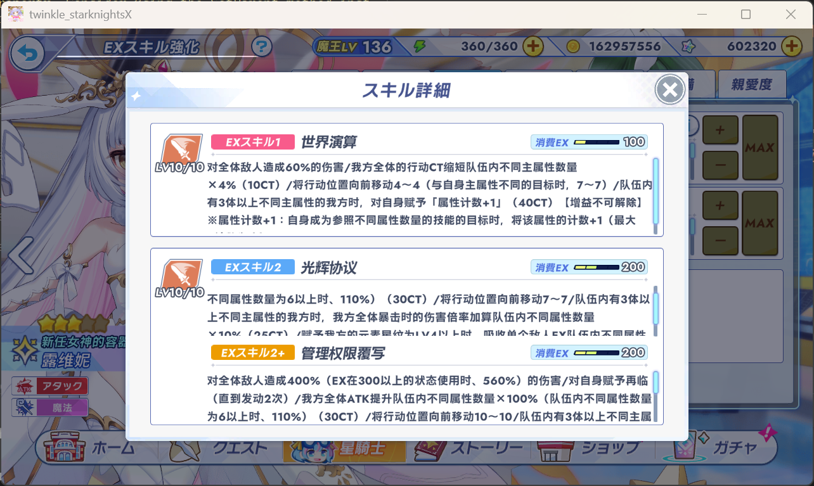

# TSKHook

## 关于这个 UI 汉化 Fork

本 Fork 基于 [TSKModding/TSKHook](https://github.com/TSKModding/TSKHook)，目标是在原项目剧情翻译功能之外，补充游戏内常用 UI 文本的简体中文翻译。UI 汉化数据的整理、编译与维护方法请参阅 [translations/ui/README.md](translations/ui/README.md)。

> [!warning]
> 本项目的汉化文本工作全部由大模型进行，我只进行了少量的校对（不到十分之一），所以可能存在大量文本问题

### 汉化效果

### 安装方法

- 安装原项目
- 使用release中的dll替换Twinkle_StarKnights\BepInEx\plugins下的原dll
- 将release中的汉化文件ui_translations.jsonl放到Twinkle_StarKnights\BepInEx\plugins\TSKHook\ui_translations.jsonl

### 已实现的功能

- 从游戏网络响应中结构化采集 UI 文本，并按稳定身份增量合并、去重和分类。
- 提供适合批量翻译的源文件、术语约束、翻译规则，以及面向大语言模型的翻译工作流。
- 将翻译数据编译为运行时 JSONL 文件，由 Mod 建立内存索引并快速替换文本，避免高频界面逐条扫描翻译文件。
- 覆盖角色名、技能名称与说明、物品、装备、任务、商店、奖励等大量常用 UI 文本。
- 对源文版本变化提供兼容匹配，并检查占位符、富文本标签、数字与换行等容易被翻译破坏的内容。
- 补充中文字体回退与 TextMeshPro 动态字体处理，解决缺字和动态 Atlas 不可写等问题。

### 当前没有实现的内容

- 尚未完整汉化写在图片中的文字，例如部分导航按钮、活动入口和大型功能按钮。
- 尚未提供将任意汉化图片自动重新打包回原 Unity AssetBundle 或 Spine Atlas 的通用工具链。
- Sprite、SpriteAtlas、Texture2D 与 Spine Atlas 的运行时导出，以及普通 Sprite 的运行时替换已经完成实验性实现并通过实机测试，但目前单独保留在实验分支中，暂未合入主分支继续扩展。

### 暂停图片汉化的技术原因

游戏中相当一部分视觉文字并不是普通文本组件，而是 Unity Sprite Atlas 或 Spine `SkeletonGraphic` 的组成部分。紧密打包的 Sprite 不能只依靠矩形坐标可靠裁剪；Spine 按钮还会把多个 Atlas 区域通过骨骼、插槽、动画和材质重新组合。完整替换时必须同时保持 UV、区域尺寸、透明度或预乘 Alpha、材质引用及对象生命周期一致。

此外，这些资源可能由游戏按需下载并缓存，界面切换时对象还会被销毁和重新创建。要把实验性替换扩展成稳定、可维护且能适应游戏更新的通用方案，需要继续解决资源身份识别、加载时机、重载和清理，以及 Spine 多区域重组等问题。综合实现成本和维护风险后，主分支目前优先维护结构化 UI 文本汉化。

### 欢迎参与和共享成果

欢迎通过 Issue 或 Pull Request 分享新的文本采集结果、翻译与术语修正、测试反馈，以及更可靠的 Unity/Spine 图片资源替换方案。提交采集数据前请移除账号等私人信息；分享图片相关成果时，也请避免直接分发完整的原始游戏资源包。

### AI注意

- 本fork主要使用 GPT 5.6 sol 进行开发
- 汉化工作由 deepseek v4-pro 与 deepseek v4-flash 进行

## [中文](README_TC.md)

Twinkle Star Knights mod for DMM Game Player version

## Feature

1. Game speed (more fun if Ready Go is faster, is not?^^)
   
2. In-game Screenshot
3. FPS setting
4. [Translation](Translation.md) (Traditional Chinese only)
5. Game window size setting
6. Picture Book zoom ratio

## Requirement

1. Windows 10 or newer
2. Twinkle Star Knights DMM Game Player version

## Installation

Download and extract [Release](https://github.com/TSKModding/TSKHook/releases) zip to your Twinkle Star Knights install
location `C:\Users\<username>\Twinkle_StarKnightsX`

## Config

You can edit config.json(`./BepInEx/plugins/config.json`) if you don't like default settings.

| Name      | Default Value | Description                                                  |
|-----------|---------------|--------------------------------------------------------------|
| speed     | 0.5           | Increase/Decrease game speed each step (per click)           | 
| fps       | 60            | Override FPS setting, take effects when value bigger than 60 |
| translate | true          | Enable/Disable translation feature                           |
| width     | 1280          | Game window width                                            |
| height    | 720           | Game window height                                           |
| zoom      | 1.0           | Character standing zoom in/out ratio                         |

## Key binding

| Key  | Type        | Description                                                                   |
|------|-------------|-------------------------------------------------------------------------------|
| F1   | Reload      | Reload TSKHook config, useful when you need to resize game window size        |
| F5   | Freeze      | Freeze game, mean set game speed to 0x                                        |
| F6   | Reset       | Reset game speed to 1x/normal                                                 | 
| F7   | Decrease    | Decrease game speed (2-0.5 etc), depends on your `speed` config               | 
| F8   | Increase    | Increase game speed (1+0.5 etc), depends on your `speed` config               |
| F10  | Translation | Clear translation cache                                                       |
| F11  | Translation | Enable/Disable translation feature                                            |
| F12  | Screenshot  | Screenshot current frame and save to Pictures(`C:\Users\<username>\Pictures`) |
| Ctrl | Skip text   | Skip text via Ctrl button, just like Galgame control system                   |

## Contributing

You're free to contribute to TSKHook as long as the features are useful, such as battle stats log, 360 stamina alert or
something else, except modifying battle data.

## Disclaimer

Using TSKHook violates Twinkle Star Knights and DMM's terms of service.

I will NOT be held responsible for any bans!
